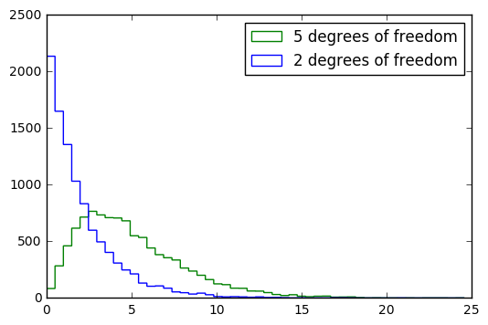

---

_You are currently looking at **version 1.0** of this notebook. To download notebooks and datafiles, as well as get help on Jupyter notebooks in the Coursera platform, visit the [Jupyter Notebook FAQ](https://www.coursera.org/learn/python-data-analysis/resources/0dhYG) course resource._

---

# Distributions in Pandas


```python
import pandas as pd
import numpy as np
```


```python
np.random.binomial(1, 0.5)
```


    0


```python
np.random.binomial(1000, 0.5)/1000
```


    0.506


```python
chance_of_tornado = 0.01/100
np.random.binomial(100000, chance_of_tornado)
```


    7


```python
chance_of_tornado = 0.01

tornado_events = np.random.binomial(1, chance_of_tornado, 1000000)
    
two_days_in_a_row = 0
for j in range(1,len(tornado_events)-1):
    if tornado_events[j]==1 and tornado_events[j-1]==1:
        two_days_in_a_row+=1

print('{} tornadoes back to back in {} years'.format(two_days_in_a_row, 1000000/365))
```

    117 tornadoes back to back in 2739.72602739726 years


```python
np.random.uniform(0, 1)
```


    0.8970483784607954


```python
np.random.normal(0.75)
```


    1.2812869911449396


Formula for standard deviation
$$\sqrt{\frac{1}{N} \sum_{i=1}^N (x_i - \overline{x})^2}$$


```python
distribution = np.random.normal(0.75,size=1000)

np.sqrt(np.sum((np.mean(distribution)-distribution)**2)/len(distribution))
```


    0.95760985717776892


```python
np.std(distribution)
```


    0.95760985717776892


```python
import scipy.stats as stats
stats.kurtosis(distribution)
```


    0.05668860214864191


```python
stats.skew(distribution)
```


    0.1363723063467568


```python
chi_squared_df2 = np.random.chisquare(2, size=10000)
stats.skew(chi_squared_df2)
```


    2.069212487712475


```python
chi_squared_df5 = np.random.chisquare(5, size=10000)
stats.skew(chi_squared_df5)
```


    1.1728093835027107


```python
%matplotlib inline
import matplotlib
import matplotlib.pyplot as plt

output = plt.hist([chi_squared_df2,chi_squared_df5], bins=50, histtype='step', 
                  label=['2 degrees of freedom','5 degrees of freedom'])
plt.legend(loc='upper right')

```

    /opt/conda/lib/python3.5/site-packages/matplotlib/font_manager.py:273: UserWarning: Matplotlib is building the font cache using fc-list. This may take a moment.
      warnings.warn('Matplotlib is building the font cache using fc-list. This may take a moment.')
    /opt/conda/lib/python3.5/site-packages/matplotlib/font_manager.py:273: UserWarning: Matplotlib is building the font cache using fc-list. This may take a moment.
      warnings.warn('Matplotlib is building the font cache using fc-list. This may take a moment.')


    <matplotlib.legend.Legend at 0x7fda2f1a9f28>





# Hypothesis Testing


```python
df = pd.read_csv('grades.csv')
```


```python
df.head()
```


<div>
<table border="1" class="dataframe">
  <thead>
    <tr style="text-align: right;">
      <th></th>
      <th>student_id</th>
      <th>assignment1_grade</th>
      <th>assignment1_submission</th>
      <th>assignment2_grade</th>
      <th>assignment2_submission</th>
      <th>assignment3_grade</th>
      <th>assignment3_submission</th>
      <th>assignment4_grade</th>
      <th>assignment4_submission</th>
      <th>assignment5_grade</th>
      <th>assignment5_submission</th>
      <th>assignment6_grade</th>
      <th>assignment6_submission</th>
    </tr>
  </thead>
  <tbody>
    <tr>
      <th>0</th>
      <td>B73F2C11-70F0-E37D-8B10-1D20AFED50B1</td>
      <td>92.733946</td>
      <td>2015-11-02 06:55:34.282000000</td>
      <td>83.030552</td>
      <td>2015-11-09 02:22:58.938000000</td>
      <td>67.164441</td>
      <td>2015-11-12 08:58:33.998000000</td>
      <td>53.011553</td>
      <td>2015-11-16 01:21:24.663000000</td>
      <td>47.710398</td>
      <td>2015-11-20 13:24:59.692000000</td>
      <td>38.168318</td>
      <td>2015-11-22 18:31:15.934000000</td>
    </tr>
    <tr>
      <th>1</th>
      <td>98A0FAE0-A19A-13D2-4BB5-CFBFD94031D1</td>
      <td>86.790821</td>
      <td>2015-11-29 14:57:44.429000000</td>
      <td>86.290821</td>
      <td>2015-12-06 17:41:18.449000000</td>
      <td>69.772657</td>
      <td>2015-12-10 08:54:55.904000000</td>
      <td>55.098125</td>
      <td>2015-12-13 17:32:30.941000000</td>
      <td>49.588313</td>
      <td>2015-12-19 23:26:39.285000000</td>
      <td>44.629482</td>
      <td>2015-12-21 17:07:24.275000000</td>
    </tr>
    <tr>
      <th>2</th>
      <td>D0F62040-CEB0-904C-F563-2F8620916C4E</td>
      <td>85.512541</td>
      <td>2016-01-09 05:36:02.389000000</td>
      <td>85.512541</td>
      <td>2016-01-09 06:39:44.416000000</td>
      <td>68.410033</td>
      <td>2016-01-15 20:22:45.882000000</td>
      <td>54.728026</td>
      <td>2016-01-11 12:41:50.749000000</td>
      <td>49.255224</td>
      <td>2016-01-11 17:31:12.489000000</td>
      <td>44.329701</td>
      <td>2016-01-17 16:24:42.765000000</td>
    </tr>
    <tr>
      <th>3</th>
      <td>FFDF2B2C-F514-EF7F-6538-A6A53518E9DC</td>
      <td>86.030665</td>
      <td>2016-04-30 06:50:39.801000000</td>
      <td>68.824532</td>
      <td>2016-04-30 17:20:38.727000000</td>
      <td>61.942079</td>
      <td>2016-05-12 07:47:16.326000000</td>
      <td>49.553663</td>
      <td>2016-05-07 16:09:20.485000000</td>
      <td>49.553663</td>
      <td>2016-05-24 12:51:18.016000000</td>
      <td>44.598297</td>
      <td>2016-05-26 08:09:12.058000000</td>
    </tr>
    <tr>
      <th>4</th>
      <td>5ECBEEB6-F1CE-80AE-3164-E45E99473FB4</td>
      <td>64.813800</td>
      <td>2015-12-13 17:06:10.750000000</td>
      <td>51.491040</td>
      <td>2015-12-14 12:25:12.056000000</td>
      <td>41.932832</td>
      <td>2015-12-29 14:25:22.594000000</td>
      <td>36.929549</td>
      <td>2015-12-28 01:29:55.901000000</td>
      <td>33.236594</td>
      <td>2015-12-29 14:46:06.628000000</td>
      <td>33.236594</td>
      <td>2016-01-05 01:06:59.546000000</td>
    </tr>
  </tbody>
</table>
</div>


```python
len(df)
```


    2315


```python
early = df[df['assignment1_submission'] <= '2015-12-31']
late = df[df['assignment1_submission'] > '2015-12-31']
```


```python
early.mean()
```


    assignment1_grade    74.972741
    assignment2_grade    67.252190
    assignment3_grade    61.129050
    assignment4_grade    54.157620
    assignment5_grade    48.634643
    assignment6_grade    43.838980
    dtype: float64


```python
late.mean()
```


    assignment1_grade    74.017429
    assignment2_grade    66.370822
    assignment3_grade    60.023244
    assignment4_grade    54.058138
    assignment5_grade    48.599402
    assignment6_grade    43.844384
    dtype: float64


```python
from scipy import stats
stats.ttest_ind?
```


```python
stats.ttest_ind(early['assignment1_grade'], late['assignment1_grade'])
```


    Ttest_indResult(statistic=1.400549944897566, pvalue=0.16148283016060577)


```python
stats.ttest_ind(early['assignment2_grade'], late['assignment2_grade'])
```


    Ttest_indResult(statistic=1.3239868220912567, pvalue=0.18563824610067967)


```python
stats.ttest_ind(early['assignment3_grade'], late['assignment3_grade'])
```


    Ttest_indResult(statistic=1.7116160037010733, pvalue=0.087101516341556676)


